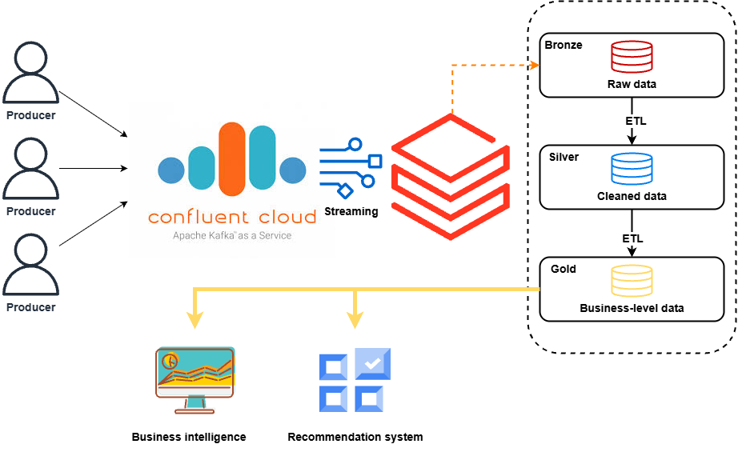

# Xây dựng Pipeline Xử lý Dữ liệu lớn (Amazon Reviews) cho BI và Hệ thống Gợi ý

Đây là bài tập lớn môn học **"Phân tích Dữ liệu lớn và Trí tuệ Kinh doanh"** (Lớp L01, Năm học 2025-2026) tại Trường Đại học Bách Khoa TP.HCM.

Dự án này xây dựng một pipeline dữ liệu end-to-end sử dụng Apache Kafka và Databricks để xử lý bộ dữ liệu Amazon Reviews (danh mục "Books"). Pipeline này phục vụ cho hai mục đích chính:
1.  **Business Intelligence (BI):** Xây dựng mô hình Lược đồ hình sao (Star Schema) để trực quan hóa và phân tích nghiệp vụ.
2.  **Hệ thống Gợi ý (Recommendation System):** Triển khai phương pháp luận **STAR** (A Simple Training-free Approach) để đưa ra gợi ý sản phẩm cho người dùng.

## Kiến trúc Hệ thống

Kiến trúc tổng quan của dự án tuân theo mô hình Medallion (Bronze-Silver-Gold) trên nền tảng Databricks, với dữ liệu được nạp real-time từ Apache Kafka (Confluent Cloud).

## Công nghệ sử dụng

* **Nền tảng Dữ liệu:** Databricks
* **Luồng Dữ liệu:** Apache Kafka (Confluent Cloud)
* **Xử lý Dữ liệu:** Apache Spark (Spark Structured Streaming, PySpark SQL)
* **Lưu trữ:** Delta Lake
* **Mô hình Gợi ý:** Phương pháp STAR [1] (sử dụng FAISS và SentenceTransformers)
* **Ngôn ngữ:** Python

## Nguồn dữ liệu

* **Bộ dữ liệu:** Amazon Review 2023 [2]
* **Danh mục:** "Books" (Bao gồm ~4.4 triệu sản phẩm và ~29.5 triệu đánh giá).

## Luồng xử lý Pipeline

Dự án được chia thành các giai đoạn chính, tương ứng với các thư mục và notebooks:

### 1. Tầng Bronze (Thu thập Dữ liệu thô)
* **Mục tiêu:** Thu thập dữ liệu streaming từ Kafka và lưu trữ nguyên vẹn dưới dạng bảng Delta.
* **Notebooks:**
    * `1.bronze/item_stream_kafka.ipynb`: Nạp dữ liệu metadata sản phẩm (sách) từ topic `book-metadata`.
    * `1.bronze/review_stream_kafka.ipynb`: Nạp dữ liệu đánh giá (reviews) từ topic `book-reviews`.

### 2. Tầng Silver (Làm sạch và Chuẩn hóa)
* **Mục tiêu:** Chuyển đổi dữ liệu từ Bronze sang Silver. Quá trình này bao gồm giải mã (decode) JSON, làm sạch (xử lý NULL, giá trị rác như '---', 'n/a'), chuẩn hóa kiểu dữ liệu, và khử trùng lặp (deduplication).
* **Notebook:** `2.silver/ETL_bronze_to_silver.ipynb`

### 3. Tầng Gold (Mô hình hóa Dữ liệu)
* **Mục tiêu:** Tạo các bảng dữ liệu đã được tổng hợp, tối ưu hóa cho các tác vụ nghiệp vụ cụ thể.
* **Notebooks:**
    * `3.gold/ETL_Product_Star_Schema.ipynb`: Xây dựng mô hình **Lược đồ hình sao (Star Schema)** cho tác vụ BI.
    * `3.gold/ETL_RS_silver_to_gold.ipynb`: Chuẩn bị dữ liệu tương tác (`star_interactions`) và metadata sản phẩm (`star_items`) cho Hệ thống Gợi ý.

### 4. Hệ thống Gợi ý (Recommendation System - STAR)
* **Mục tiêu:** Triển khai phương pháp luận STAR, kết hợp tín hiệu ngữ nghĩa (Semantic) và tín hiệu cộng tác (Collaborative).
* **Notebooks:**
    * `4.Recommendation_system/4.1.emb_star_item.ipynb`: Tạo vector embedding cho văn bản metadata của sản phẩm (sử dụng model `all-MiniLM-L6-v2`).
    * `4.Recommendation_system/4.2.R_S_score.ipynb`: Tính toán ma trận **Tương quan Ngữ nghĩa ($R_S$)** bằng cách sử dụng FAISS để tìm K láng giềng gần nhất (ANN).
    * `4.Recommendation_system/4.3.R_C_score.ipynb`: Tính toán ma trận **Tương quan Cộng tác ($R_C$)** dựa trên sự đồng xuất hiện (co-occurrence) của sản phẩm trong lịch sử người dùng (Cosine Similarity).
    * `4.Recommendation_system/4.4.final_score_and_rerank.ipynb`: Tính điểm cuối cùng. Kết hợp $R_S$ và $R_C$, áp dụng hệ số suy giảm theo thời gian ($\lambda=0.7$) và trọng số cân bằng ($\alpha=0.5$), sau đó xếp hạng (Top-K=30) cho mỗi người dùng.
    * `4.Recommendation_system/4.5.Evaluation.ipynb`: Đánh giá hiệu suất của mô hình bằng chiến lược "last-item-out-of-sequence".

## Kết quả Đánh giá (K=30)

Hệ thống được đánh giá dựa trên việc dự đoán tương tác *cuối cùng* của mỗi người dùng (dữ liệu test) từ các tương tác trước đó của họ (dữ liệu train).

| Chỉ số | Giá trị | Ý nghĩa |
| :--- | :--- | :--- |
| **Hit Rate (HR@30)** | `0.060` (6.0%) | 6.0% người dùng tìm thấy sản phẩm họ đã tương tác trong 30 gợi ý hàng đầu. |
| **Coverage (Độ phủ)** | `0.888` (88.8%) | Hệ thống có khả năng gợi ý 88.8% tổng số sản phẩm, cho thấy khả năng khám phá "long-tail" tốt, không bị "popularity bias". |
| **NDCG@30** | `0.032` | Chất lượng xếp hạng, ưu tiên các gợi ý đúng ở vị trí cao. |
| **MRR** | `0.025` | Trung bình thứ hạng nghịch đảo của gợi ý đúng đầu tiên. |
| **Vị trí Hit Trung bình** | `6.57` | Khi một gợi ý đúng, nó thường xuất hiện ở vị trí thứ 6 hoặc 7. |

## Tác giả

* Nguyễn Thanh Khánh - 2211527
* Phạm Bá Nhật Khang - 2211460
* Nguyễn Gia Thuận - 2213356

**Giáo viên hướng dẫn:** Đỗ Thanh Thái

## Tài liệu tham khảo

[1] Dong-Ho Lee, et al. (2025). *STAR: A Simple Training-free Approach for Recommendations using Large Language Models*. arXiv:2410.16458 [cs.IR].

[2] *Amazon Review 2023 Dataset*. https://amazon-reviews-2023.github.io/